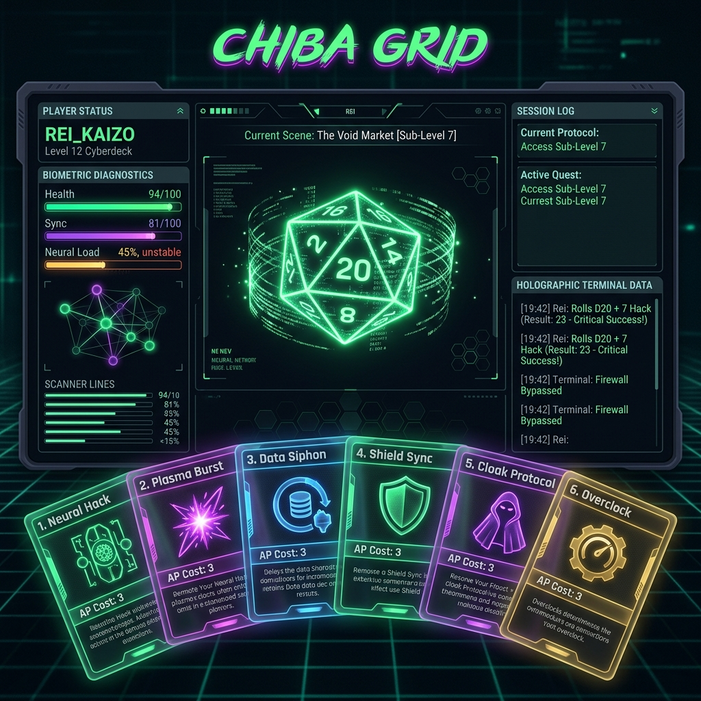
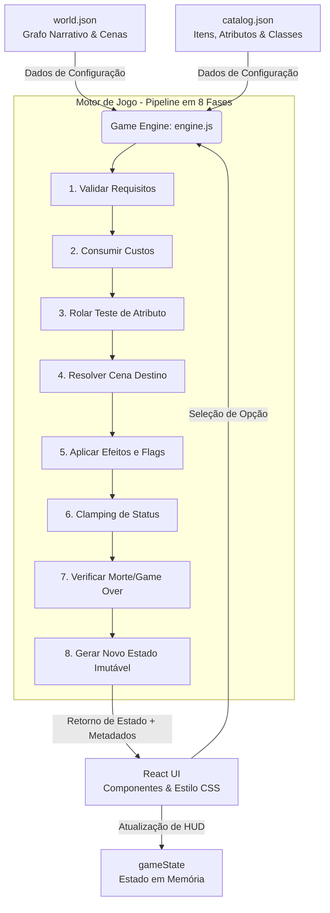

# 🌌 Chiba Grid // RPG de Mesa Cyberpunk



**Um simulador narrativo de RPG cyberpunk com motor de decisão stateful, sistema de consequências encadeadas e engine de jogo desacoplada de UI — construído como estudo de arquitetura de produto interativo e portfólio de Product Management / Product Analytics.**

---

## 💡 Por que eu construí isso

Construí o **Chiba Grid** para materializar a intersecção entre engenharia de dados, design de sistemas complexos e gestão de produtos interativos. Em minha transição de carreira focada em **Produto e Product Analytics**, percebi que os projetos de portfólio costumam focar puramente em desenvolvimento front-end ou em lógica estática básica. 

Meu objetivo aqui foi ir além: projetar uma engine de jogo com estado robusto e determinístico, simulando tomadas de decisão sob risco (testes D20) e criando caminhos narrativos dinâmicos. Este projeto serve como um laboratório prático para estudar arquitetura de informação, conversão em árvores de decisão complexas, UX de alta fidelidade e segmentação de comportamento do jogador.

---

## 🧠 Decisões de Produto Documentadas

Esta seção detalha as principais decisões tomadas durante o design do produto, os trade-offs considerados e a justificativa estratégica de cada escolha:

| Decisão de Produto | Alternativa Considerada | Racional (Por que escolhemos isso) |
| :--- | :--- | :--- |
| **Engine Desacoplada da UI** | Lógica de estado e transições de cena acopladas dentro dos componentes React. | **Testabilidade e Portabilidade.** A lógica de jogo é um motor de regras puro (`engine.js`). Isso possibilita rodar simulações de comportamento em lote, testes automatizados (CI) sem renderização gráfica e facilita a portabilidade para outros frameworks (ou CLI) sem reescrever o núcleo do produto. |
| **Mecânica de *Fail Forward* nas Rolagens** | *Game Over* direto ou interrupção imediata da narrativa ao falhar em testes de atributos. | **Retenção e Engajamento do Usuário.** A falha no dado não bloqueia a progressão (o que causaria frustração e abandono precoce), mas gera ramificações narrativas desvantajosas (perda de recursos, ferimentos ou aumento de nível de alerta), mantendo o jogador engajado na jornada. |
| **Arquitetura de Estado com Flags + Contadores** | Utilização exclusiva de flags booleanas para controle de progresso e história. | **Profundidade de Gradação de Estado.** O uso de contadores numéricos (ex: `credits`, `nivel_alerta`, `HP`, `sanity`) em conjunto com flags lógicas permite criar regras de transição dinâmicas e balanceadas, abrindo espaço para análises avançadas de comportamento (ex: correlação entre nível de alerta e taxa de falha). |
| **Múltiplos Inícios baseados em Classe** | Fluxo de início único e linear para todos os jogadores do jogo. | **Aumento de Replayability e Cohort Analysis.** Cada classe (*Solo*, *Netrunner*, *Techie*) inicia o jogo em uma cena diferente e com itens iniciais específicos. Isso estimula o jogador a repetir a experiência para explorar novos caminhos e permite segmentar dados de engajamento por coorte de classes. |
| **Mesa de Cartas em Leque 3D com `:has()`** | Menu tradicional em lista vertical de botões de escolhas estáticas. | **Imersão Tátil e Redução de Fricção.** Ao dispor as ações como cartas em leque tridimensional que respondem fisicamente ao foco (afastando as cartas adjacentes), reduzimos a fadiga de leitura e simulamos a sensação física de uma mesa de RPG, melhorando o tempo médio de sessão. |
| **Dossiês Biométricos na Criação** | Formulário e botões padrão de seleção de classe na tela inicial. | **Redução de Drop-off no Funil de Integração (Onboarding).** A tela de criação exibe um diagnóstico de varredura biométrica sequencial que introduz o universo narrativo antes mesmo do início real da partida, aumentando a taxa de conversão de onboarding. |

---

## 📐 Arquitetura do Sistema

O fluxo do jogo adota um ciclo determinístico onde a interface gráfica do usuário (UI) é um reflexo direto do estado computado pelo motor puro. A estrutura de dependências do fluxo se comporta conforme o diagrama abaixo:



---

## 🛠️ Stack Tecnológica e Racionais

*   **React 19:** Renderização ultra-eficiente de componentes e suporte a transições e hooks modernos para uma experiência reativa rápida.
*   **Vite:** Ciclo de desenvolvimento ágil com Fast Refresh instantâneo para rápidos ajustes visuais e de design.
*   **TailwindCSS v4.0 + Custom CSS:** Estilização baseada em utilitários e CSS puro para efeitos avançados de CRT, ruído estático, neon glows e transformações 3D interativas.
*   **Sem TypeScript:** Decisão consciente de velocidade de prototipação para validar o modelo de dados narrativo de forma ágil nesta fase.
*   **Graphify:** Ferramenta de análise estática e grafos para mapear a complexidade relacional das dependências de código e consistência da narrativa.

---

## 🎮 Como Jogar / Como Executar

### 🌐 Demonstração Online
🚀 [Acesse a Versão Implantada na Vercel](https://rpg-de-mesa-azure.vercel.app/)

### 💻 Instalação e Execução Local

1. Instale as dependências do projeto:
   ```bash
   npm install
   ```

2. Execute o servidor de desenvolvimento local:
   ```bash
   npm run dev
   ```

3. Execute o test runner integrado para validar a engine e o grafo narrativo:
   ```bash
   node src/game/testRunner.js
   ```

---

## 🎯 Backlog de Produto (Roadmap)

- [ ] **Mapeamento de Eventos (Product Analytics):** Criar um módulo de tracking local no `localStorage` (com possibilidade de envio para Mixpanel/Amplitude) para medir o funil de conversão (Onboarding -> Início -> Decisões Críticas -> Finais).
- [ ] **Mecânica de Sucesso Parcial (Fase 3.5 da Engine):** Adicionar gradientes de sucesso nas rolagens de dados (ex: sucesso com consequências, falha com benefício sutil) para enriquecer a árvore de decisão do produto.
- [ ] **Ato II Narrativo:** Adição de mais de 30 novas cenas interconectadas com ramificações de espionagem corporativa no núcleo da Arasaka.
- [ ] **Painel de Jornada Final:** Exibir um gráfico visual da rota tomada pelo jogador em comparação com todos os caminhos possíveis da narrativa ao concluir uma partida.

---

## 📈 Principais Aprendizados

A construção do **Chiba Grid** forneceu insights profundos sobre o design de produtos digitais interativos com alta complexidade de estado:

1. **Valor do Desacoplamento:** Manter o motor do jogo isolado da interface gráfica (`engine.js` puro) provou que sistemas complexos de negócio devem ser independentes do framework para serem testáveis, estáveis e de fácil manutenção.
2. **Design Focado em Engajamento:** Mecânicas de UX de alta imersão, como a mesa de cartas disposta em 3D, aumentam o apelo estético imediato e o tempo de retenção do usuário.
3. **Gerenciamento de Complexidade Orientada a Dados:** Utilizar arquivos JSON estruturados para descrever o mundo narrativo nos ensinou como projetar plataformas flexíveis que permitem que criadores de conteúdo modifiquem o produto sem tocar no código de produção.
